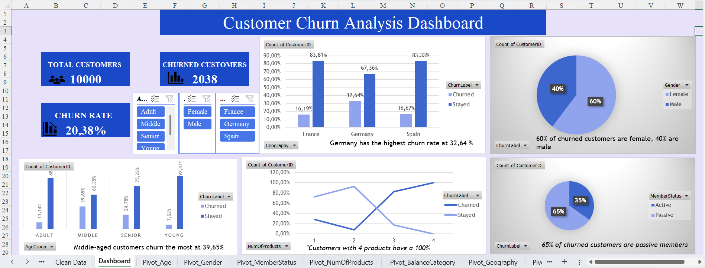

# 📊 Customer Churn Analysis Dashboard

An interactive Excel dashboard analyzing customer churn behavior using the **Customer Churn Records** dataset.

## 📈 Preview

## 🛠️ Tools Used
* **Microsoft Excel** (Pivot Tables, Pivot Charts, KPI Cards, Slicers)
* **Data Cleaning & Engineering** (Power Query / Excel Formulas)

## 📁 Dataset Details
* **Source:** Kaggle
* **Rows:** 10,000 customers
* **New Columns Created:**
    * `AgeGroup`: Categorizes customers into Young (18-30), Adult (31-45), Senior (46-60), and Middle (61+).
    * `ChurnLabel`: Converts 0/1 data into "Churned" / "Stayed" for better readability.
    * `MemberStatus`: Converts IsActiveMember (0/1) to "Active" / "Passive".
    * `BalanceCategory`: Groups balances into No Balance, Low, Medium, and High.
    * `CreditCategory`: Groups credit scores into Low, Medium, Good, and Excellent.
## 📌 KPI Metrics
* **Total Customers:** 10,000
* **Churned Customers:** 2,038
* **Churn Rate:** 20.38%

## 🔍 Key Findings
* 🌍 **Germany** has the highest churn rate at **32.64%**.
* 👥 **Middle-aged** customers churn the most at **39.65%**.
* 💳 Customers with **4 products** have a **100% churn rate**.
* 👩 **60%** of churned customers are **female**.
* 😴 **65%** of churned customers are **passive members**.

## 👤 Author
**Aytan**
